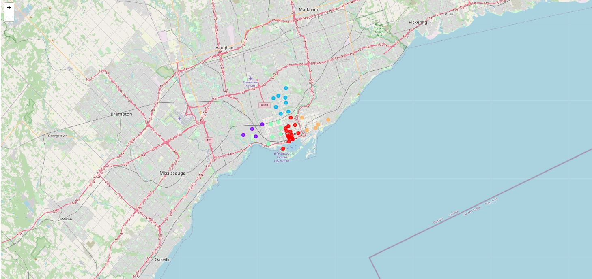

# Segmenting-Clustering-Neighborhoods-Toronto
 Assignment to explore, segment, and cluster the neighborhoods in the city of Toronto
 Following is the visualization of neighborhood in Canada where borough contain Toronto

Following is visualization of cluster data using the KMeans ML algorithm

